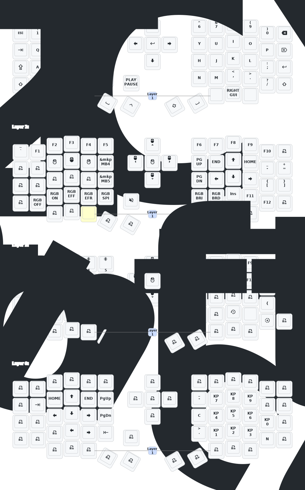

- [Chinese](README.md)
- [English](README_EN.md)

# Update List
- 2025/3/30
  1. Added 1-hour sleep entry time
  2. Added debounce time
  3. Optimized power consumption after sleep
- 2024/12/21
  1. Added support for zmk-studio (just refresh the left hand to use).
- 2024/10/24
  1. Modified power supply mode to reduce power consumption.
  2. Fixed automatic power-off for RGB lighting.

> If your keyboard was updated before October 24, please update to the latest firmware.
> 
---
# Contact Me

For 3D printed model files or any issues and malfunctions with the keyboard, please contact 380465425@qq.com

# Sofle Keymap

